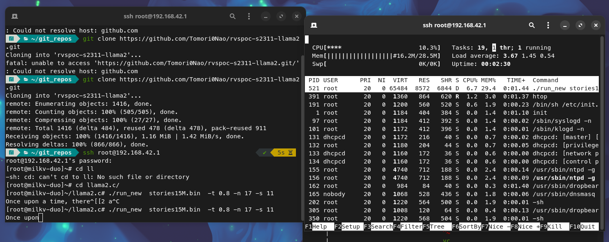
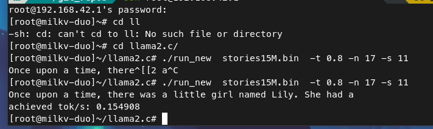
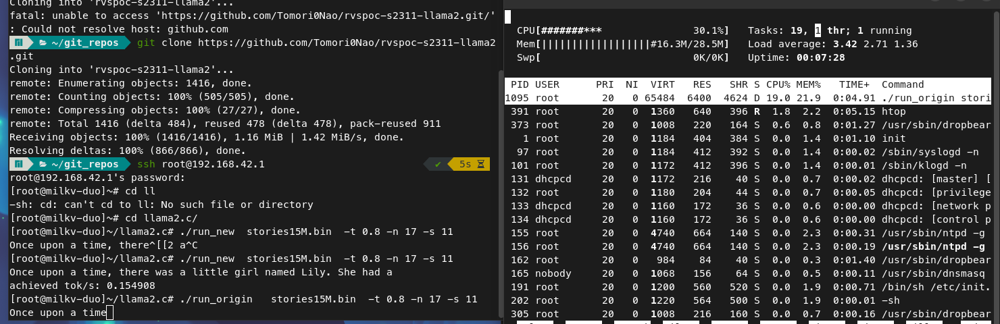
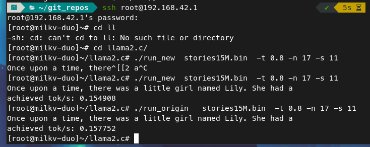

# llama2 在 milk duo 上的优化
## 优化手段分析
通过分析原程序在 milk duo 上的运行情况，可以从以下两个方面尝试提高运行速度：
- 优化源码，提高 cpu 利用率
具体可从*指令优化*及*提高cache命中率*两方面考虑
- 优化文件io
模型文件本身较大，其中包含的数据在读取时将会消耗大量时间
- 启用 cv1800b 的第二个核
将开发板单核变为双核，理论上能够加快程序运行，至少多线程将不再是负优化
## 我所完成的工作
- 通过使用 riscv 的 vector 指令集，加快浮点数的运算，提高程序运行速度
- 尝试通过将大矩阵分解为小矩阵，提高 cache 命中率，从而优化运行速度（因为编写出来的代码有问题，最终放弃）
- 尝试修改 linux kernel 配置项，从而编译生成能够感知调度第二个核的镜像（由于需要编译uboot 、linux kernel等，项目文件结构太过复杂，且不熟悉设备树，最终放弃 ）
## 最终结果
### 优化后 程序资源占用率

### 优化后 token 生成速度

### 优化前 程序资源占用率

### 优化前 token 生成速度

## 总结
通过优化前后 token 生成速度的对比，可得出结论：
程序运行速度的瓶颈不是 cpu 执行速度，而是文件io、cache命中率等因素，
本次优化尝试从加快程序运行的角度是失败的，但也发现了程序优化的正确方向，并且将 cpu 占用率减低至原来的 *1/3*，且我在尝试过程中学习到了关于 vector 指令集使用、编译器选项含义等知识，加深了我对于 risc v 体系结构的了解
## 编译注意事项
请在执行 `source envsetup.sh` ，下载编译工具链后，再运行 `make`
```shell
source envsetup.sh
make
```