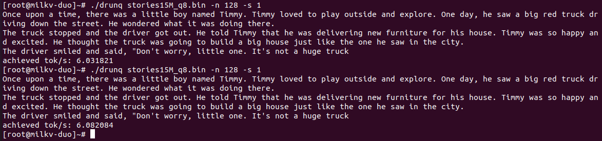

# Baby LLaMA 2 on Duo 速度优化

## 项目描述

让 Baby LLaMA 2 运行在 Milk-V Duo 这样的小板子上是很有挑战的事情。本次竞赛旨在提升 Baby LLaMA 2 在 Milk-V Duo 平台上的性能，目标是实现更高的每秒 Token 处理速度。参赛者需要运用轻量级技术和编译器优化策略，结合麦克风语音输入或命令行输入提示词等多种方式，开发一个能够讲故事的机器人 Demo。该 Demo 应通过扬声器进行输出，并可借鉴小米米兔讲故事机器人的原型设计。

## 文档内容

- Baby LLaMA 2 推理速度优化
  - 推理耗时分析
  - 优化思路
  - 优化结果

- 文本转`.wav`语音文件
- 未实现语音驱动输出功能

## 优化结果展示

### 针对 stories15M.bin 参数

| 尝试方案         | 优化选项  | 速度(token/s) | 说明 |
| -----------     | ------    | ----- | ----- |
| 基线             | -O3      |  0.370  |  |
| 代码同基线       | -Ofast      |  0.355  |  |
| RVV优化矩阵乘法     |    -O3    | 0.312 |  单独矩阵乘法速率1.2x加速，但由于内存限制，矩阵乘法优势无法体现，开启swap分区也无法加速，可能因为权重需要频繁在内存和swap间转移 |
| 增加 -fopenmp 编译选项    |   -O3 -fopenmp      | 0.420 | 略有加速  |
| 将权重加载至内存      |    -O3     | 0.198 | 效果下降明显，需要开启swap分区 |
| int8量化    |   -O3     |     | 需要开启swap分区 |
| int8量化    |  -O3 -fopenmp    |   6.165    | 效果好，基本与 -Ofast 优化器持平，需要开启swap分区 |
| int8量化    | -Ofast -fopenmp  |   6.436    | 效果好，需要开启swap分区 |

- 所有参数为 `-n 32 -s 1`，即生成 32 个token，随机数设为1。可以尝试其他值。
- 上述测试时将输出重定向到文本，例如 `run stories15M.bin -n 32 -s 1 > output.txt`，重定向到文本比输出至控制台更快。

### 针对 stories256K.bin 参数

由于内存限制，对矩阵乘法优化在 stories15M.bin 中显现不出效果，用更小的权重 stories256K.bin 可以看出其效果。
| 尝试方案        |优化选项| 速度(token/s)  |
| -----------    | ----------- | ----- |
| 基线           |   -O3       | 162.3 |
| RVV优化矩阵乘法 |   -O3       | **211.9** |
| 增加 -fopenmp 编译选项     |   -O3 -Ofopenmp    | 195.6 |

## 优化代码操作步骤

### 最优方案

使用编译好的 `runq_best` 和对应权重 `stories15M_q8.bin` 二进制文件发送至Duo，生成故事命令：

```shell
# Duo开启共享内存
mkswap /dev/mmcblk0p3
swapon /dev/mmcblk0p3

# Duo生成故事
./runq_best stories15M_q8.bin -n 32 > stories.txt  # 生成故事至文件
cat stories.txt                                    # 查看生成的故事
```

可以增加 `-n 32 -s 1` 等分别控制生成token数量和随机数。

### 编译细节

编译代码主机（简称主机）为 Ubuntu20.04 虚拟机。假设`riscv64-linux-musl-x86_64`安装主机的在 `/opt/riscv/` 路径下，如果不同则修改该部分内容。

2. 基线编译命令：

```shell
# 主机上：编译
/opt/riscv/riscv64-linux-musl-x86_64/bin/riscv64-unknown-linux-musl-gcc -D_LARGEFILE_SOURCE -D_LARGEFILE64_SOURCE -D_FILE_OFFSET_BITS=64 -I/opt/riscv/riscv64-linux-musl-x86_64/sysroot/usr/include -mcpu=c906fdv -march=rv64imafdcv0p7xthead -mcmodel=medany -mabi=lp64d -L/opt/riscv/riscv64-linux-musl-x86_64/sysroot/lib -L/opt/riscv/riscv64-linux-musl-x86_64/sysroot/usr/lib -O3 -o run run.c -lm

# Duo
./run stories15M.bin
./run stories15M.bin -n 4 -s 1 # 指定token数量和随机数
```

3. 使用int8量化量化（目前最佳版本，需开启swap分区）

```shell
# 主机上：编译
/opt/riscv/riscv64-linux-musl-x86_64/bin/riscv64-unknown-linux-musl-gcc -D_LARGEFILE_SOURCE -D_LARGEFILE64_SOURCE -D_FILE_OFFSET_BITS=64 -I/opt/riscv/riscv64-linux-musl-x86_64/sysroot/usr/include -mcpu=c906fdv -march=rv64imafdcv0p7xthead -mcmodel=medany -mabi=lp64d -L/opt/riscv/riscv64-linux-musl-x86_64/sysroot/lib -L/opt/riscv/riscv64-linux-musl-x86_64/sysroot/usr/lib -Ofast -o runq_best runq.c -lm -fopenmp -static-libgcc -static

# 主机上：生成量化后权重 stories15M_q8.bin
python export.py  stories15M_q8.bin --version 2 --checkpoint stories15M.pt

# Duo: 开启swap分区
mkswap /dev/mmcblk0p3
swapon /dev/mmcblk0p3

# Duo: 运行生成故事
./runq stories15M_q8.bin -n 32 -s 1
```

使用 `-static-libgcc -static` 编译成静态链接，避免Duo上没有OpenMP相关库。

4. 使用RVV加速矩阵运算（需开启swap分区）

```shell
# 主机上：先转置权重，因此矩阵RVV优化中矩阵采用列主序
gcc transpose_weight.c -o transpose_weight  # 编译权重转换指令
cp stories15M.bin stories15M.transpose.bin
./transpose_weight stories15M.transpose.bin  # 此时 stories15M.transpose.bin 即为转置后权重

# 主机上：编译
/opt/riscv/riscv64-linux-musl-x86_64/bin/riscv64-unknown-linux-musl-gcc -D_LARGEFILE_SOURCE -D_LARGEFILE64_SOURCE -D_FILE_OFFSET_BITS=64 -I/opt/riscv/riscv64-linux-musl-x86_64/sysroot/usr/include -mcpu=c906fdv -march=rv64imafdcv0p7xthead -mcmodel=medany -mabi=lp64d -L/opt/riscv/riscv64-linux-musl-x86_64/sysroot/lib -L/opt/riscv/riscv64-linux-musl-x86_64/sysroot/usr/lib -O3 -o runt run_transpose.c -lm

# Duo
./runt stories15M.transpose.bin -n 32 -s 1
```

如果要需要为权重分配内存，则更改 `read_checkpoint` 中的 `memory_map_weights`函数为 `memory_map_weights2`即可。

### 针对 stories256K.bin 参数

```shell
# 主机上：先转置权重，因此矩阵RVV优化中采用列主序
gcc transpose_weight.c -o transpose_weight  # 编译权重转换指令
cp stories260K.bin stories260K.transpose.bin
./transpose_weight stories260K.transpose.bin  # 此时 stories15M.transpose.bin 即为转置后权重

# Duo
./run stories260K.bin -n 1024 -s 1 > stories260K.txt                      # 基线
./runt stories260K.transpose.bin -n 1024 -s 1 > stories260K.transpose.txt # 矩阵优化后
```

可以通过 `cat stories260K.transpose.txt` 指令查看生成内容，两个文件内容一致，尽管发现优势 runt 会报 dump segmetation，在 stories15M.transpose.bin 模型中无此错误，暂时未找到原因。

## 代码分析

Baby LLaMA 2项目[github](https://github.com/karpathy/llama2.c) 中给出了C语言本版的LLaMA推理实现，其主要内容包括：

- 神经网络模块结构体
  - `struct Config`: 网络配置
  - `struct TransformerWeights`: Transformer权重
  - `struct RunState`: 运行时的中间状态，例如矩阵乘法得到的结果

- 权重读取、映射、释放内存等辅助函数
  - `malloc_run_state`，`free_run_state`: 初始化与释放
  - `build_transformer`, `free_transformer`: 初始化与释放
  - `memory_map_weights`: 将权重映射到`struct TransformerWeights`
  - `read_checkpoint`: 读取权重，会调用`memory_map_weights`

- 神经网络模块函数
  - `rmsnorm`, `softmax`, `matmul`: 网络里面的基本函数
  - `forward`: 前向传播实现

- 其他Token编解码相关结构体或函数（优化时未考虑）
  - `struct ProbIndex`, `struct Sampler`.
  - `sample_argmax`, `sample_mult`, `compare`, `sample_topp`, `build_sampler`, `free_sampler`, `random_u32`, `random_f32`, `sample`, `time_in_ms`.

对所有代码进行分析，运算层面值得优化的为矩阵乘法实现 `matmul` 函数，源代码中实现为：

```python
void matmul(float* xout, float* x, float* w, int n, int d) {
    // W (d,n) @ x (n,) -> xout (d,)
    // by far the most amount of time is spent inside this little function
    int i;
    #pragma omp parallel for private(i)
    for (i = 0; i < d; i++) {
        float val = 0.0f;
        for (int j = 0; j < n; j++) {
            val += w[i * n + j] * x[j];
        }
        xout[i] = val;
    }
}
```

该函数实现了 `W (d,n) @ x (n,) -> xout (d,)` 的矩阵乘法，并且作者给出注释“by far the most amount of time is spent inside this little function”，含义为“目前运行中大部分消耗在这简短的几行代码上”。以 `stories15M.bin` 权重为例，生成 10 个token。

函数调用关系为： `generate` 调用 `forward`，`forward`调用 `matmul`。

消耗时间：`generate`耗时 3904 ms，`forward` 耗时 `3844 ms`，`matmul` 耗时 `3822 ms`，$3822/3904 = 97.9\%$。

**结论：对话生成中，约 $98\%$ 的时间耗费在矩阵乘法 `matmul` 中。**

因此，通过优化 Duo 矩阵乘法速度是加速推理的手段之一。

### 矩阵大小分析

上述得出矩阵乘法占据推理中约 $98\%$ 的时间，输出矩阵乘法，可以得出 Baby LLaMA 2中做乘法的实际为矩阵与向量相乘，其输入矩阵维度为$d$行$n$列，所乘向量为 $n$ 个元素，输出向量为 $d$ 个元素。矩阵大小如下：

| 矩阵名称      | 矩阵大小($d\times n$) | 乘法次数 |
| ----------- | ----------- | ----- |
| `wq`      | $(288\times 288)$        | 6 |
| `wk`      | $(288\times 288)$        | 6 |
| `wv`      | $(288\times 288)$        | 6 |
| `wo`      | $(288\times 288)$        | 6 |
| `w1`      | $(768\times 288)$        | 6 |
| `w2`      | $(288\times 768)$        | 6 |
| `w3`      | $(768\times 288)$        | 6 |
| `wcls`    | $(32000\times 288)$      | 1 |

可见其中矩阵 `wcls` 明显比其他矩阵大得多。

## 性能瓶颈

在实测推理中发现，对于 `stories15M.bin` 并使用 `float32` 类型权重时，推理速度慢，使用 `free -m` 查看内存占用率，发现内存占用几乎不变，CPU利用率也很低。

推理前CPU使用和内存占用：


推理中CPU和内存：


发现内存几乎就增加 2M，CPU利用率在5%-30%左右浮动。`float32` 的模型将近有 58M，分析载入代码发现，在载入权重的函数 `read_checkpoint` 通过内存映射函数 `mmap` 实现内存映射，而不是使用 `malloc` 或 `calloc` 等分配内存并复制权重。这也许是限制推理速度的重要原因，因为从磁盘中读取权重速度远比从内存中读取慢。最终推理10个token，速度为 0.36 token/s。

## 优化思路

通过上述分析，得出四种可行的优化思路：

- 使用GEMM优化矩阵乘法
- 将权重加载至内存
- 使用量化，将模型量化为 int8 类型
- 使用编译器优化选型加速

## 优化效果分析

### GEMM矩阵乘法优化

GEMM的优化主要集中在提高计算效率和利用硬件特性方面。以下是一些常见的优化技术：

- 缓存友好性：通过重组计算顺序以利用缓存，减少内存访问次数，从而提高性能。
- 矩阵分块：将大矩阵分解成小的子矩阵，以便在缓存中存储并重复使用数据，减少内存访问的非连续性。
- 指令级并行：利用SIMD指令集，如SSE和AVX，同时处理多个数据，加速计算。
- 多线程并行：使用多个线程同时处理不同的矩阵乘法操作，充分利用多核处理器的性能。

对原来矩阵乘法使用缓存友好、矩阵分块、RVV指令集进行优化，测试10次，优化前矩阵乘耗时约 73 ms，使用 `riscv64-unknown-linux-musl-gcc` 交叉编译器，开启 `-O3` 优化，对比如下：

|  矩阵大小($d\times n$)    | 优化前平均耗时(ms) | 优化后平均耗时(ms) |  优化后/前耗时比 |
| ----------- | ----------- | ----- | --- |
| $(288\times 288)$      |   0.676 | 0.501 |  0.742 |
| $(768\times 288)$      |   1.784 | 0.951 |  0.533 |
| $(288\times 768)$      |   1.734 | 1.339 |  0.772 |
| $(32000\times 288)$    |   73.20 | 58.87 |  0.804 |

可以看出，优化后耗时大约变为原来的 80% 左右。

另外根据矩阵大小及使用次数，可以估计优化前每次 `forward`中`matmul`函数耗时大约为 120 ms 左右，则上限速度应有 1000/120 = 8 token/s，优化后大约达到 10 token/s， 远远高于实际所得的 0.36 token/s。

使用RVV实现的矩阵乘法代码如下，其具有和原项目中 `matmul` 几乎一样的接口，唯一区别是其中权重矩阵 `w` 变成其转置 `wt`，这样做是因为原项目实现使用行主序，现在针对RVV换成列主序更高效。

```python
#include <riscv_vector.h>
#define VLEN 32
void vector_multiply(int n, int d, size_t vlen, const float *w,
        const float *x, float *xout)
{
    // xout = x[i] * w + xout
    int i;
    vfloat32m8_t vw, vxout;
    vxout = vle32_v_f32m8(xout, vlen);
    for (i=0; i<n; i++) {
        vw = vle32_v_f32m8(w, vlen);
        vxout = vfmacc_vf_f32m8(vxout, x[i], vw, vlen);
        w += d;
    }
    vse32_v_f32m8(xout, vxout, vlen);
}

void matmul(float* xout, float* x, float* wt, int n, int d) {
    // Wt (n,d) @ x (n,) -> xout (d,)
    memset(xout, 0, d * sizeof(float));

    size_t i, j;
    size_t vlen = VLEN;
    const int nn = 4;
    memset(xout, 0, d * sizeof(float));
    #pragma omp parallel for private(i)
    for(j=0; j<n; j+=nn) {
      for(i=0; i<d; i+=vlen) {
        vector_multiply(nn, d, vlen, wt+i+j*d, x+j, xout + i);
      }
    }
}
```

由于矩阵乘法接口发生转变，因此需要对训练所有权重也转置，提供文件 `transpose_weight.c`，将其本地编译二进制文件 `transpose_weight`，在本地对其中进行转换，再将转换后的权重等传送到Duo进行测试。`transpose_weight` 会在原空间内实现矩阵转置，因此先拷贝一份权重。
使用示例：

```shell
gcc transpose_weight.c -o transpose_weight  # 编译权重转换指令
cp stories15M.bin stories15M.transpose.bin
./transpose_weight stories15M.transpose.bin  # 此时 stories15M.transpose.bin 即为转置后权重
```

### 将权重加载至内存

由于 `float32` 类型的 `stories15M.bin` 权重总共为 58M 字节，部分内存分配给系统和超过系统可用的内存大小（约38M），因此需要开启 swap 空间。开启后，然而，通过 `malloc` 或 `calloc` 分配内存后，并未获得明显加速，完成 $(32000\times 288)$ 仍然耗时 350 ms 左右，而不是期待的不到 60 ms。

未实现加速可能原因：仔细分析后发现，运行时占用 38 M 内存和 15 M 交换空间，由于每次生成token时需要遍历权重，则一定存在将部数据从swap空间搬运到内存，这在每次生成 token 时都出现，这一机制严重影响读取效率，导致系统浪费大量时间在IO操作上。事实上，目前主流的做法是将权重完全加载到内存再进行模型推理，而应避免使用swap空间。


### 将模型量化为 int8 类型

模型量化能在一定程度上加速推理速度，Baby LLaMA 作者也提供了模型量化C语言实现代码 `runq.c`，`riscv64-unknown-linux-musl-gcc` 交叉编译器，开启 `-O3` 优化，如果使用swap分区，将直接报错。开启默认的256M swap分区后，运行模型，速率为 token/s。查看内存和CPU利用率，此时CPU有92%。

### 使用编译器优化选型加速

尝试使用 OpenMP 对模型进行加速。由于模型在单核上运行，而 OpenMP 的 MP 代表多线程，开启 OpenMP 优化似乎有些反直觉。事实上，在 float32 类型权重中开启 OpenMP 优化，性能没有提升，反而略有下降。但在量化后的 int8 类型中，性能却明显提升，可能是因为量化实现的 `matmul` 中有大量 `int8` 到 `int32` 转换，以及 `int32` 和 `float32` 相乘的转换指令，导致整个矩阵乘法使用多线程更有优势。

量化版本 `runq.c` 中实现的 `matmul` 代码如下：

```python
void matmul(float* xout, QuantizedTensor *x, QuantizedTensor *w, int n, int d) {
    // W (d,n) @ x (n,) -> xout (d,)
    // by far the most amount of time is spent inside this little function
    // inputs to this function are both quantized

    int i;
    #pragma omp parallel for private(i)
    for (i = 0; i < d; i++) {
        float val = 0.0f;
        int32_t ival = 0;
        int in = i * n;
        // do the matmul in groups of GS
        int j;
        for (j = 0; j <= n - GS; j += GS) {
            for (int k = 0; k < GS; k++) {
                ival += ((int32_t) x->q[j + k]) * ((int32_t) w->q[in + j + k]);
            }
            val += ((float) ival) * w->s[(in + j) / GS] * x->s[j / GS];
            ival = 0;
        }
        xout[i] = val;
    }
}
```

此时查看 CPU 和内存利用率，此时使用18M左右内存（图中的32M内存中在运行程序前已经有14M已使用内存）和22M交换空间，CPU利用率90%左右。尽管使用较多交换空间，但`int8`类型权重本身仅有15M左右，因此权重不存放在交换空间，使得程序整体效率更高。


最终生成故事例子如下图，可见语法和拼写基本正确，而且上下文具有一定连贯性。



## 文本转`.wav`语音文件

项目链接：https://github.com/festvox/flite

在 Duo 上使用 Flite 例子：


包含交叉编译二进制的文件见 Flite.tar.gz。

## 结论

根据上述分析，可以得出Baby LLaMA 2 on Duo 优化的相关结论。

- `float32`类型的`stories15M.bin`权重占用内存低的原因是该内存使用`mmap`进行内存映射读取权重，而不是给权重分配内存。权重读取速度限制处理器处理速度，因此CPU利用率也低。此时性能为
- 由于自带内存较小，不能加载`float32`类型的`stories15M.bin`。开启256M swap分区后尽管可以加载权重，但处理速度并没有得到提升，反而有一定下降，其性能为。可能是因为每次循环中均要将部分权重从swap分区转移至内存中。swap分区本质是硬盘的存储区域，用于缓存暂时不用的数据。每生成一个token都要使用权重，按照先进先出的环形队列，很可能造成最近需要使用的权重在swap分区中，反而导致性能下降。
- Baby LLaMA 2 on Duo生成故事中，约98%花费在矩阵计算。使用矩阵分块、缓存友好性和RVV等GEMM技巧可以加速矩阵计算，性能大概提升1.2倍左右，因此也可以将生成token效率提高1.2倍左右。验证时可以单独使用矩阵乘法验证，也在`stories256K.bin`权重上验证。
- 在CPU不变的情况下，如果内存足够（如128M），估计 Baby LLaMA 2 on Duo优化前可以达到 8 token/s，优化后可以达到 10 token/s。
